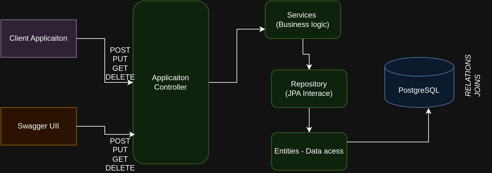
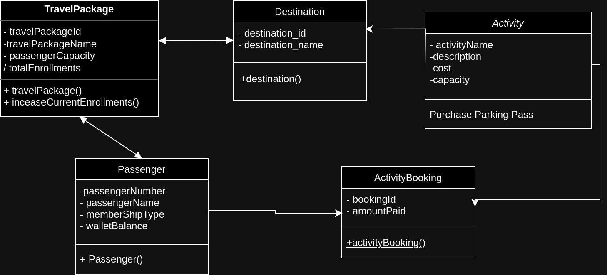
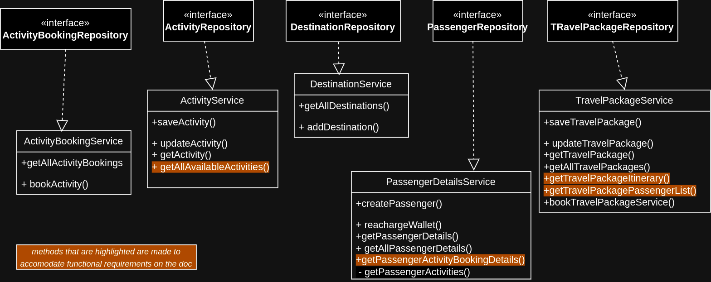

# Nymble-Traveller
## About 
This project is a Spring Boot-based application designed to manage and organize travel packages and related activities. It offers a comprehensive system for handling travel itineraries, including tracking destinations, activities available at each location, bookings, and passenger management. The application serves as a robust platform for travel agencies or related businesses to streamline their operations and offer enhanced services to their clients

## High-Level Design (HLD)

The system can interact with client side apps through standard HTTP methods. The application controller directs incoming requests to the service layer, where the business logic resides. These services interact with the repository layer to perform CRUD operations on the domain entities corresponding to database tables managed by PostgreSQL. The repository layer abstracts the data persistence mechanisms, facilitating communication between the object-oriented application code and the relational database, which includes complex relationships and joins. 


## UML Class Diagram

 diagram above shows the basic UML class diagram for the application. Contains the application entities and their relationships with each other.
 

 UML class diagram for the application Services. Contains the application services and the interface they implement. Highlighted methods are the ones that were mentioned explicitly in the requirement document.

### Installation

1. Clone the repo
   ```sh
    git clone https://github.com/CyberneTech/Nymble-Traveller.git
   ```
2. Create a PostgreSQL database and note the URL, username and password.
3. Update the datasource settings in `application.properties` file with your database URL, username and password.
   ```sh
    spring.datasource.url=jdbc:postgresql://localhost:5432/mydb 
    spring.datasource.username=postgres
    spring.datasource.password=password
   ```
4. Build the project using Maven:
* Navigate to the project directory in the terminal.
* Run the following Maven command to build the project and download all the necessary dependencies:
  ```sh
   mvn clean install
   ```
5. After the build is successful, start the Spring Boot application with the following command:
   ```sh
   mvn spring-boot:run
   ```
6. Access Swagger UI:
Once the application is running, access Swagger UI at 
   ```sh
   http://localhost:8080/swagger-ui/index.html 
   ```
(to see and test the API endpoints)

### Testing Endpoints with Postman
 A Postman collection is available to test the API endpoints: {Link to Postman collection}
 <br/>To test the API endpoints:
*Import the Postman collection and make sure the application is running at `http://localhost:8080.`*

## Database Choice - PostgreSQL
For this project, PostgreSQL was selected as the database solution due to its alignment with system requirements and its inherent strengths
- **Relational Model:** PostgreSQL's relational model is ideal for our system, involving entity relationships, such as *one-to-many relationships between destinations and activities*, and other relationships between entities
- **ACID Compliance:** The need for consistent and reliable transactions, especially for *updating passenger balances and activity capacities*, makes PostgreSQL's ACID compliance a critical feature.
- **Advanced Query Capabilities:** The system benefits from PostgreSQL's ability to efficiently handle JOIN operations, crucial for generating detailed *itineraries and passenger lists*.
- **Schema Enforcement:** Following *SOLID principles* in our application design is facilitated by PostgreSQL's schema enforcement.

## Future Enhancements
- [ ] implementing DTO's for better response payloads for APIs and enhanced security
- [ ] integrating user authentication
- [ ] add a queueing service (eg:Kafka)
- [ ] integrating with client side application
- [ ] indexing database/ hot partitioning
